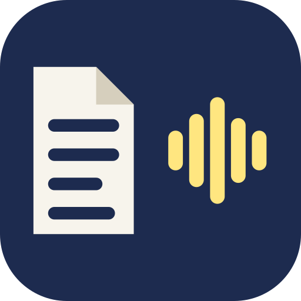
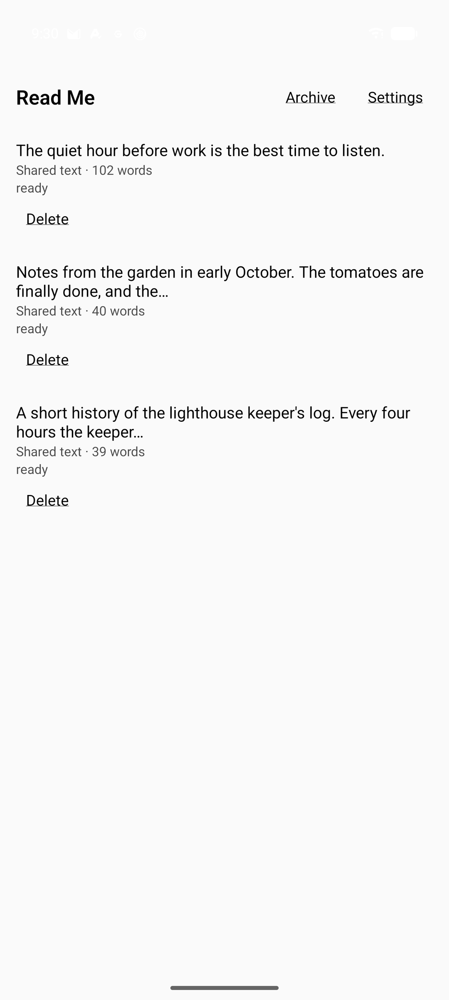
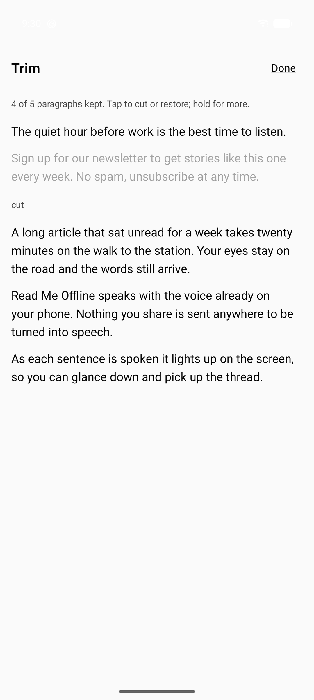
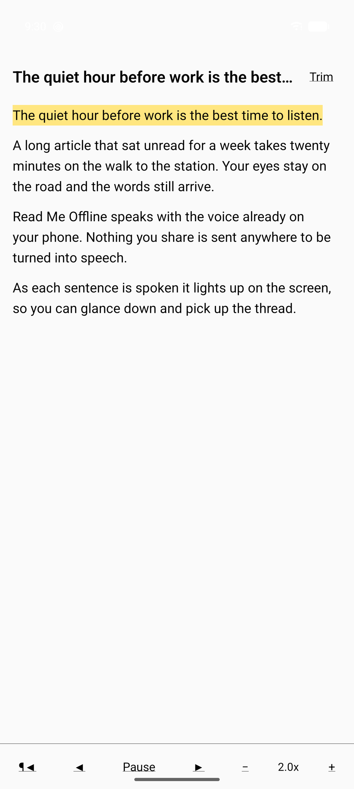
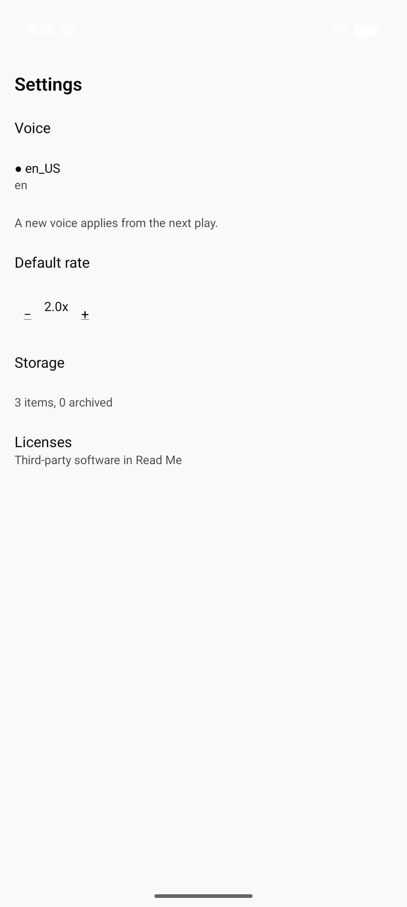

<p align="center"></p>

<h1 align="center">Read Me Offline</h1>

<p align="center">
<b>Share it, trim it, listen to it.</b><br>
On the phone, offline, no account, no cloud voice.
</p>

Read Me Offline is a light Android reader that reads articles and text aloud with the
text-to-speech voice already on your phone. Share a link from your browser or selected text
from any app, cut the parts you don't want, and listen at speed with the screen off.

It has a second job: an on-device speech bridge for **Obsidian**. Obsidian's Android app gives
plugins no way to reach the phone's speech engine, so Read Me Offline will serve that engine to
the [`local-tts-reader`](https://github.com/JoshShearer/Note-Reader-Local) plugin over a
loopback connection that only the phone itself can reach. Your notes get read aloud by an
offline voice and never leave the device. See [The Obsidian bridge](#the-obsidian-bridge).

<p align="center">




</p>

> **Status:** in development, not yet released. The reader is built and verified on a real
> phone: share, extract, trim, play in the background, the four screens, and the Obsidian
> bridge, called from inside Obsidian on the same phone. The plugin side of the bridge is still
> in progress (NRL-130). The roadmap is in
> [`docs/superpowers/plans/2026-10-01-roadmap.md`](docs/superpowers/plans/2026-10-01-roadmap.md).

---

## Features

### Share anything readable

- **Links:** share a page from any browser. A link is detected even inside the usual
  "Title https://..." shape that browsers share. The item appears in your list at once, and the
  page is fetched in the background, so you go straight back to what you were doing.
- **Text:** share selected text from any app and it is ready to read straight away. Paragraphs
  are split on blank lines.
- **Article extraction:** Mozilla Readability runs on the phone and keeps only the article:
  title, site, byline, headings, paragraphs and list items. Navigation, ads, figures and
  embeds are dropped. The raw page is discarded as soon as it has been extracted.
- **Honest failure states:** nothing disappears silently. A link that can't be fetched stays in
  the list with its reason (offline, timeout, too large, too many redirects, an HTTP status...)
  and offers Retry, a hint to share the text instead, or Delete. A page that yields very little
  text (paywalls, pages built by JavaScript) shows what was found and offers Read anyway.

### Trim before you listen

- Tap a paragraph to cut it: a newsletter plug, a comment section, a "related stories" block.
  Tap again to restore it.
- Hold a paragraph for **Cut everything after this** or **Start here**.
- Cuts are **never destructive**. The original paragraphs are always kept, so every cut can be
  undone, even after you've started listening. If you change cuts mid-read, your place stays put
  when its paragraph is still kept.
- Trim opens the first time you open an item; after that it is one tap away from the Reader.

### Listen with the screen off

- **On-device speech only.** Android's own `TextToSpeech` engine does the speaking. Voices
  that need a network connection are never offered and never used as a fallback.
- **Sentence highlight** that follows along and stays in view while the Reader is open.
- **Background playback** through a foreground service with a media session, so the lock
  screen, notification, headset and media buttons all work. Playback pauses for calls and
  navigation prompts and when headphones disconnect.
- **Speed from 0.5x to 4x** in 0.1x steps (default 2x). The engine applies the rate once, at
  synthesis, so the voice stays natural rather than being sped up afterwards.
- **Gapless at speed:** the native service queues sentences ahead of the voice. Measured on the
  reference phone over 10 minutes at 2x, on battery, in forced Doze, with the screen off: gap
  between sentences p50 7 ms, p95 17 ms, max 31 ms, no stalls.
- **Your place is saved after every sentence**, and the native service owns the queue, so
  playback carries on even if Android reclaims the app's UI. Finished items move to the Archive,
  where you can restore or delete them.

### Settings

Offline voice picker, default rate, storage summary, and the licenses of every third-party
component shipped in the app. If the phone has no speech engine or no offline voice, the Reader
says so and links to Android's speech settings.

---

## The Obsidian bridge

> **Built in Phase 5.** The design below is the contract in [`srs.md`](srs.md) (R-M12,
> "Bridge contract"), verified on the reference device by `npm run device:bridge`. The plugin
> side is still in progress (NRL-130).

### Why it exists

Neural TTS inside Obsidian's Android WebView can't keep up: Kokoro missed real-time 2x playback
by 8.2x, because the WebView is limited to one WASM thread and has no WebGPU, and a plugin can't
change either. The phone's native engine, reached through a prototype bridge, synthesized at a
real-time factor of 0.116 to 0.169 at rate 1.0 (4.0 to 4.2 times faster than 2x playback),
fully offline. Those figures were measured on 2026-09-30 and 2026-10-01 and are recorded in the
plugin repo's `AGENTS.md`.

### How it works

```text
Obsidian (local-tts-reader plugin)
   │  POST http://127.0.0.1:8787/synthesize?rate=1.0
   │  Authorization: Bearer <token>        note text in the body, never the URL
   ▼
Read Me Offline  ── BridgeServer, loopback only, its own TextToSpeech instance
   │  synthesizes with the offline voice chosen in Read Me's Settings
   ▼
audio/wav  ──►  the plugin's Player plays it and applies your speed
```

- **Off until you turn it on** in Settings. While it runs, a foreground notification says so,
  with a button to turn it off. On Android 13 and later it needs the notification permission,
  and stays off without it. After a restart of the phone it comes back when you next open Read
  Me Offline.
- **Loopback only.** It binds `127.0.0.1` explicitly; nothing off the phone can reach it.
- **Paired by token.** A random 128-bit token is shown in Settings with a Copy button and pasted
  into the plugin. Every route except `GET /health` requires it, and it is never logged or put
  in a URL.
- **Hardened against hostile input.** The token is checked before the body is read. Headers are
  capped at 16 KiB and the body at 64 KiB, every socket has a 10 s read timeout, and every
  connection's failure is caught, so no request can take the service down. Synthesized audio
  files are deleted on every exit path.
- **Works from Obsidian's WebView.** CORS for the `http://localhost` origin is on every
  response, errors included, so both `fetch` and `CapacitorHttp` can read the status and
  headers.
- **Rate is applied exactly once.** The plugin requests `rate=1.0` and its own Player applies
  your speed. Speeding up both would give 4x where you asked for 2x.
- **Plays nicely with the reader.** Two speech jobs on one engine slow each other down, so while
  Read Me Offline is reading aloud the bridge answers `503 busy`, which the plugin handles. One
  request speaks at most the `maxChars` that `/health` reports (ADR 0008).
- **Optional.** The plugin must keep working without Read Me Offline installed; the bridge is
  an extra engine, not a requirement.

| Route | Method | Auth | Response |
|---|---|---|---|
| `/health` | GET | none | `{ok, version: 1, ttsReady, engine, voice, port, busy, maxChars}` |
| `/synthesize?rate=<f>` | POST | Bearer token | `audio/wav`, with `X-Synth-Ms` and `X-Rate` headers; `503 {"error":"busy","reason":"playback"}` while Read Me Offline is playing |

### What the spikes have shown (reference device, 2026-10-01)

- The bridge kept synthesizing for 5 minutes with Read Me backgrounded behind Obsidian, under a
  `mediaPlayback` foreground service (SPIKE-01). From inside Obsidian's WebView, `fetch` and
  `CapacitorHttp` both got 200 with audio, and a request without the token got a readable 401.
- Two `TextToSpeech` instances in one app serialize rather than run in parallel (SPIKE-06),
  which is why the bridge answers 503 while the reader is playing (ADR 0004).

The plugin side is tracked in the plugin repo as NRL-130.

---

## Privacy

These are promises the project treats as release blockers, not preferences:

- **No cloud TTS, ever.** Speech is made on the phone. Network voices are filtered out.
- **One network call site.** The only request the app ever makes is fetching a link you
  shared, or retrying it when you tap Retry. It sends no cookies and uses no cache, follows at
  most 5 redirects, gives up after 20 s, and stops reading at 5 MB. No JavaScript, images or
  other sub-resources are loaded. A test fails the build if any app JS references `fetch`,
  `XMLHttpRequest` or `WebSocket`, and release builds replace all three with stubs that throw.
- **No accounts, analytics, crash reporting, ads, remote config or update checks.**
- **Your text stays private.** Items live in app-private storage with backup disabled. Logs
  carry counts, ids and states, never a sentence, a title or a URL path. Deleting an item
  deletes all of its text.
- **F-Droid-clean.** No Google Play Services, Firebase or proprietary SDKs. Every dependency is
  OSI-licensed (one CC-BY-4.0 data package is allowed by name, ADR 0002), checked in CI along
  with the resolved Gradle dependency tree.

---

## Requirements

- Android 7.0 (API 24) or later.
- A text-to-speech engine with at least one offline voice. Most phones have one. If yours
  doesn't, an open-source engine such as RHVoice (on F-Droid) works.
- For the bridge: Obsidian for Android with the `local-tts-reader` plugin.

## Install

Not released yet. v1 will ship as a signed APK on GitHub Releases, then on F-Droid; there are no
plans for Google Play. To try it now, build it from source.

## Build from source

Full instructions, including the exact SDK components, are in [`BUILDING.md`](BUILDING.md). In
short, with Node 22.11 or later, JDK 21 and the Android SDK:

```bash
npm ci
printf 'sdk.dir=%s\n' "$ANDROID_HOME" > android/local.properties
npm run build:release
# android/app/build/outputs/apk/release/app-release.apk
adb install -r android/app/build/outputs/apk/release/app-release.apk
```

Quality gates (CI runs the first set on every push and pull request):

```bash
npm run typecheck && npm run lint && npm test && npm run test:scripts
node scripts/check-licenses.mjs
(cd android && ./gradlew testDebugUnitTest)
scripts/fdroid-scan.sh
```

On-device checks (`npm run device:smoke`, `device:intake`, `device:playback`, `device:ui`,
`device:gap` and others) drive a single attached phone over adb. See `AGENTS.md`,
"Quality gates".

## How it's built

Bare React Native (no Expo) with TypeScript on Hermes, plus one hand-written Kotlin native
module, `ReadMeSpeech`.

- **TypeScript** handles everything pure: classifying shared text, article extraction
  (Readability over linkedom), sentence segmentation, trim math, and the four screens.
- **Kotlin** owns everything that has to keep working when the UI isn't running: the share
  hand-off, the SQLite store, the single network fetch, the playback service and its sentence
  queue, and the bridge.
- Positions are stored as character offsets, never sentence numbers, so a change in how text
  is split can never lose your place.

| Document | What it holds |
|---|---|
| [`srs.md`](srs.md) | The spec: requirements R-M01 to R-C04, spike answers, the bridge contract |
| [`CONTEXT.md`](CONTEXT.md) | Architecture map and vocabulary |
| [`docs/adr/`](docs/adr/) | Architecture decisions |
| [`BUILDING.md`](BUILDING.md) | Toolchain and build steps |
| [`AGENTS.md`](AGENTS.md) | Rules, gates and known state for contributors and coding agents |

Icons and store images come from `scripts/gen-brand.py` (`npm run brand`), store screenshots
from `npm run device:screenshots`, and the store listing text lives in
`fastlane/metadata/android/en-US/`.

## Roadmap

| Phase | | Status |
|---|---|---|
| 0 | Scaffold, CI, six feasibility spikes | Done |
| 1 | Text pipeline: intake, extraction, segmentation, trim | Done |
| 2 | Native store, share target, fetcher, start-up recovery | Done |
| 3 | Playback service, media session, gapless queue | Done |
| 4 | List, Trim, Reader and Settings screens | Done |
| 5 | Obsidian bridge | Done |
| 6 | Release: on-device acceptance runs, F-Droid metadata and reproducible build, signed APK | Planned |
| 7 | Voice and engine picker with preview, sleep timer, Markdown export, bridge deep link | Planned |

Later, after v1: save items to an Obsidian vault, per-site trim rules, shared files (`.txt`,
`.md`, `.html`, `.epub`), and possibly iOS.

## License

[MIT](LICENSE). Third-party components keep their own licenses, which the app lists under
Settings > Licenses.
